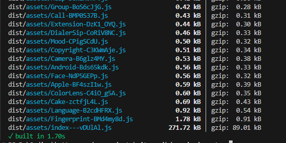

# Vite - MUI - Dynamic Imports

## How does it work?

The `utils.ts` and `utils.js` contains the list of icons that are allowed to be installed. Upon running `npm run generate:icons` the `src/icons` folder will be populated with the icons. The old icons will be purged and the new ones will be added.

After that you can run `npm run dev` to start the dev server or `npm run build` to build the project.

Add the following code to your client component for testing
```javascript
import IconsMapping from "./components/icons-mapping";
```
```javascript
<IconsMapping iconName={"Home"} />
```
| The `iconName` property is typesafe and will throw an error if you pass an invalid icon name.

## Stats

This example uses 98 icons from MUI Icons. Below are the build stats for the project.

`npm run build`

