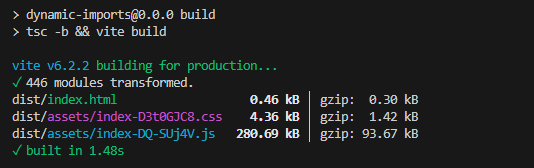

# Vite - MUI - Mapping

## How does it work?

The icons are to be added are inside `lib/icon-helpers.ts` and the mapping is done in `components/icon-mapper.tsx`. Do note that this approach falls withing the the required top-level imports for mui. This makes sure that the project can utilize [tree shaking](https://mui.com/material-ui/guides/minimizing-bundle-size/#when-and-how-to-use-tree-shaking) to minimize the bundle size automatically.

Add the following code to your client component for testing
```javascript
import IconMapper from "./components/icon-mapper";
```
```javascript
<IconMapper iconName="home" />
```
| The `iconName` property is typesafe and will throw an error if you pass an invalid icon name.

## Stats

This example uses 98 icons from MUI Icons. Below are the build stats for the project.

`npm run build`

